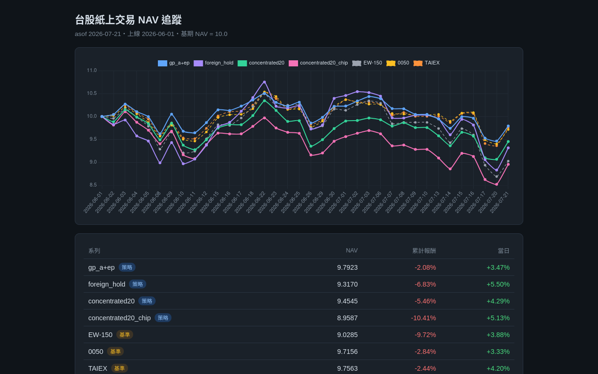

# tw-papertrade-dashboard

**Live: https://tw-papertrade-dashboard.vercel.app**



Public NAV dashboard for a Taiwan-equity paper-trading research ledger.
Static page (Chart.js) reading `data/nav.json`, which a local daily pipeline
exports and pushes after each trading day's close — Vercel auto-redeploys on push.

- 4 strategy series + 3 benchmarks (EW-150, 0050, TAIEX), forward NAV, base = 10.0 at go-live.
- Published data is NAV index values and dates only — no holdings, weights, or signals.
- Paper trading, no real money. Research log, not investment advice.

## Run locally

Static site — no build step:

```bash
python3 -m http.server
# open http://localhost:8000
```

The chart reads `data/nav.json`; the repo history doubles as the audit trail
of daily NAV updates.
